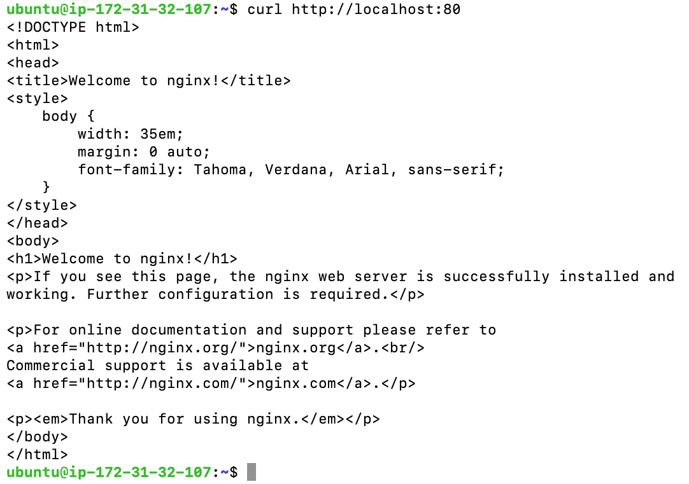
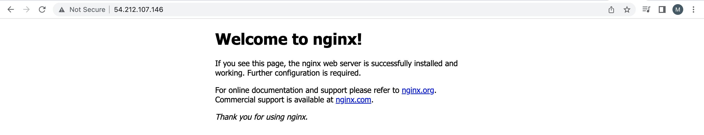
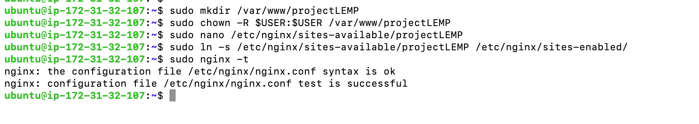
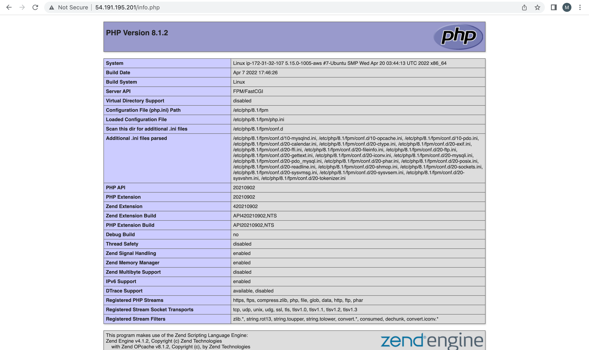
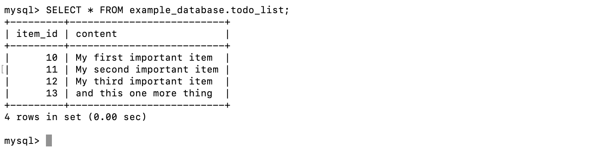
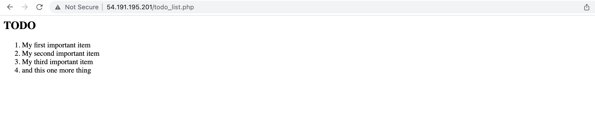

# DOCUMENTATION OF PROJECT 2: LEMP STACK IMPLEMENTATION

## INSTALLATION OF NGINX WEB SERVER

- Installed NGINX using 'apt' package manager:

```
sudo apt update
```

```
sudo apt install nginx
```

- Verified that the nginx is running as a service in my OS

```
sudo systemctl status nginx
```

- Accessed the server locally via my OS

```
curl http://localhost:80
```



- Accessed the server via internet to ensure it's perfectly working

	[Server-accessed- via-internet](https://54.212.107.146)

	

## Installation of MYSQL to store and manage my site data

- Installed MYSQL using 'apt' package manager:

```
sudo apt install mysql-server
```

```
sudo mysql
```

## Installation of php for processing code to display dynamic content to end user

- Installed PHP-FPM and PHP-MYSQL using 'apt' package manager:


```
sudo apt install php-fpm php-mysql
```


## Configured nginx to use php processor

- Created a root web directory for your_domain ( used projectLEMP as an example domain name.)

```
sudo mkdir /var/www/projectlemp
```

- Assigned ownership of the directory with the $USER environment variable, which referenced my current system user:

```
sudo chown -R $USER:$USER /var/www/projectLEMP
```

- Opened a new configuration file in Nginx’s sites-available directory:

```
sudo nano /etc/nginx/sites-available/projectLEMP
```

- Pasted the following bare bones configuration in the blank file created:

```
#/etc/nginx/sites-available/projectLEMP
server {
    listen 80;
    server_name projectLEMP www.projectLEMP;
    root /var/www/projectLEMP;
    index index.html index.htm index.php;
    location / {
        try_files $uri $uri/ =404;
    }
    location ~ \.php$ {
        include snippets/fastcgi-php.conf;
        fastcgi_pass unix:/var/run/php/php8.1-fpm.sock;
     }
    location ~ /\.ht {
        deny all;
    }
}`
```

- Activated the configuration by linking the config file from Nginx’s sites-enabled directory:

```
sudo ln -s /etc/nginx/sites-available/projectLEMP /etc/nginx/sites-enabled/
```

- Tested the configuration for syntax error:

```
sudo nginx -t
```




- Disabled the default Nginx host that is currently configured to listen on port 80 and reload nginx to apply changes :

```
sudo unlink /etc/nginx/sites-enabled/default
```

```
sudo systemctl reload nginx
```

- hence, my new website is now active. however, the web root /var/www/projectLEMP is still empty. so i created an index.html file in that location so that we can test that the new server block works as expected:

```
sudo echo 'Hello LEMP from hostname' $(curl -s http://169.254.169.254/latest/meta-data/public-hostname) 'with public IP' $(curl -s http://169.254.169.254/latest/meta-data/public-ipv4) > /var/www/projectLEMP/index.html
```

[Testing server block. Result ](https://54.212.107.146)

*The Result shows that my LEMP stack has been completely set up.*


## Testing php with nginx

- To ensure that nginx can handle .php file i created a test php file in my document root, and accessed the page through web browser:

```
sudo nano /var/www/projectLEMP/info.php
```

```
<?php
``` 
```
phpinfo();
```

[Server info. Result](http://54.191.195.201/info.php)





## Retrieivng data from mysql database with php

- A database named example_database and a user named example_user was created and gave the example_user permission over the example_database:

```
sudo mysql
```

```
CREATE DATABASE example_database;
```

```
CREATE USER 'example_user'@'%' IDENTIFIED WITH mysql_native_password BY 'password';
```

```
GRANT ALL ON example_database.* TO 'example_user'@'%';
```

`exit`

- Tested that the example_user has the proper permissions by logging in to the MySQL console again, this time using the custom user credentials:

```
mysql -u example_user -p
```

```
SHOW DATABASES;
```

- Created a test table named todo_list, then the following statement was run on mysql console, inserted a few rows of content in the table, repeated the command few times using different value:

```
CREATE TABLE example_database.todo_list (
    item_id INT AUTO_INCREMENT,
    content VARCHAR(255),
    PRIMARY KEY(item_id)
    );

```
```
INSERT INTO example_database.todo_list (content) VALUES ("My first important item");
```

- Confirmed that the table was succesfully saved:

```
SELECT * FROM example_database.todo_list;
```




`exit`


- Created a PHP script that will connect to MySQL and query for my content.

```
nano /var/www/projectLEMP/todo_list.php
```

```
`<?php
$user = "example_user";
$password = "password";
$database = "example_database";
$table = "todo_list";
try {
  $db = new PDO("mysql:host=localhost;dbname=$database", $user, $password);
  echo "<h2>TODO</h2><ol>";
  foreach($db->query("SELECT content FROM $table") as $row) {
    echo "<li>" . $row['content'] . "</li>";
  }
  echo "</ol>";
} catch (PDOException $e) {
    print "Error!: " . $e->getMessage() . "<br/>";
    die();
}
?>`
```

*copied the above statement into my todo_list.php  script*

- Accessed the page with my web browser:

[Server info. Result](http://54.191.195.201/todo_list.php)





